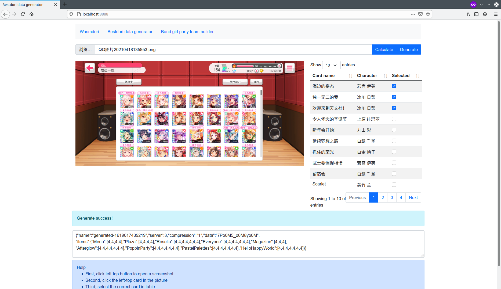

# bgp-card-recognize(WIP)

BanG Dream BGP card recognize

## DEMO

<https://chenx6.github.io/bgp-card-recognize/>

## Features

- Recognize the card in cardset and print the card id
- Encode card information to bestdori's format

## Build Requirement

- A compiler that support C++ 17 Standard
- [emsdk](https://github.com/emscripten-core/emsdk.git)

## Dependency

- OpenCV
- Nomango/jsonxx

## Build

```bash
# Please build OpenCV wasm first!
# https://docs.opencv.org/3.4/d4/da1/tutorial_js_setup.html
source ${EMSDK}/emsdk_env.sh
cd ${OPENCV_PATH}
emcmake python3 ./platforms/js/build_js.py build_wasm --build_wasm
# Build this project
mkdir build && cd build
emcmake cmake .. && emmake make -j$(nproc)
# If we want to debug in local machine, replace above command with this command
cmake -DCMAKE_BUILD_TYPE=Debug .. && make -j$(nproc)
```

## Architecture

See [ARCHITECTURE.md](./ARCHITECTURE.md)

## Screenshot



## License

```plaintext
bgp-card-recognize
Copyright (C) 2021  chen_null(abc82766@gmail.com)

This library is free software; you can redistribute it and/or
modify it under the terms of the GNU Lesser General Public
License as published by the Free Software Foundation; either
version 2.1 of the License, or (at your option) any later version.

This library is distributed in the hope that it will be useful,
but WITHOUT ANY WARRANTY; without even the implied warranty of
MERCHANTABILITY or FITNESS FOR A PARTICULAR PURPOSE.  See the GNU
Lesser General Public License for more details.

You should have received a copy of the GNU Lesser General Public
License along with this library; if not, write to the Free Software
Foundation, Inc., 51 Franklin Street, Fifth Floor, Boston, MA  02110-1301
USA
```
